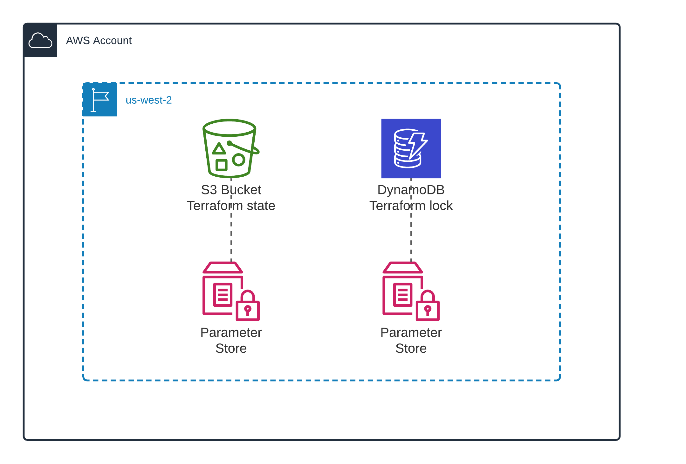

# Terraform remote state in S3 bucket

This module deploys AWS infrastructure to store Terraform remote state in S3 bucket and locks Terraform execution in DynamoDB table.

## Deployment

```shell
terraform init
terraform plan
terraform apply -auto-approve
```

## Destroy resources

```shell
terraform destroy -auto-approve
```


